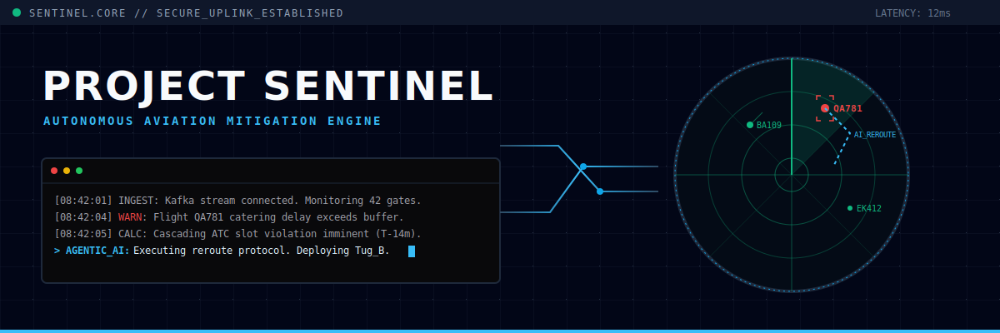

<p align="center">
  


<div align="center">
  


## LIVE SYSTEM :  https://riyaj6.github.io/ProjectSentinel/
An autonomous turnaround recovery engine for high friction aviation environments. 

Ground operations fail in minutes not hours. Sentinel is an event driven backend that ingests real time telemetry from airport gates, identifies cascading delay risks before they breach ATC slots and leverages Agentic AI to autonomously deploy mitigation workflows.

## ⚙️ Core Architecture
* **Ingestion:** High-throughput Kafka/PubSub stream processing for live ground sensors (Fuel, Catering, Baggage).
* **Evaluation Matrix:** FastAPI engine evaluating real time block times against strict ATC departure windows.
* **Agentic Mitigation:** LLM-powered resolution protocol that recalculates critical paths and issues natural language reroute commands to ground crews.

## 🚀 Quickstart

Run the system simulation locally in under 60 seconds:

```bash
# 1. Clone the repository
git clone [https://github.com/yourusername/sentinel-ops-orchestrator.git](https://github.com/yourusername/sentinel-ops-orchestrator.git)

# 2. Spin up the containerized architecture
docker-compose up -d

# 3. View the live telemetry dashboard
# Navigate to: http://localhost:8000
```
</p>
<div align="center">
We don't predict the future. We intercept it.
